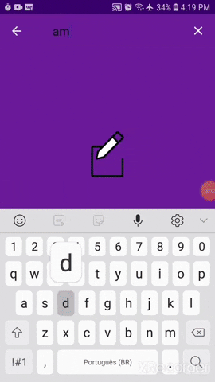
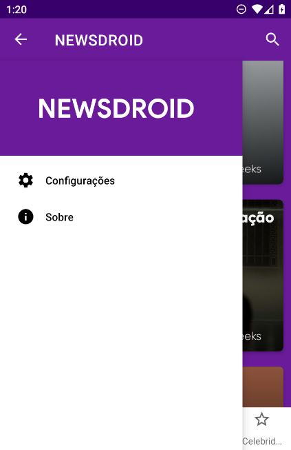
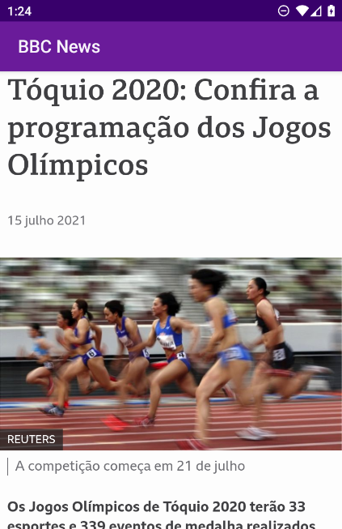
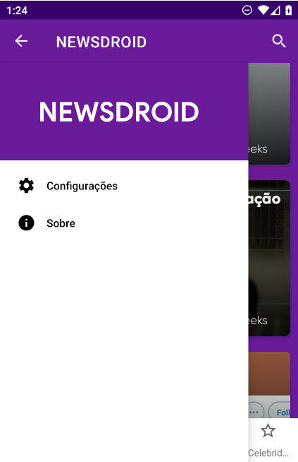

# Newsdroid
Newsdroid, aplicação Android para visualização de notícias.

Tecnologias:
<ul>
  <li>Android Studio</li>
  <li>Java</li>
  <li>News API</li>
  <li>Lottie</li>
  <li>Retrofit</li>
  <li>Glide</li>
</ul>

	
	
	
	
	
	

Link demonstração em vídeo: https://www.youtube.com/watch?v=1dMh8LGZPuY&ab_channel=AdrileySamuel

 

Screenshots:

 

<figure>
	
</figure>

 

<figure>
	
</figure>

 

 

<figure>
	
</figure>

 

 

<figure>
	
</figure>

 

 

<figure>
	
</figure>

 

 

<figure>
	
</figure>

 

 

<figure>
	
</figure>

 

 

<figure>
	
</figure>

 

 

<figure>
	
</figure>

 

 

<figure>
	
</figure>
  
 

 

<figure>
	
</figure>

 

 

<figure>
	
</figure>

 

 

<figure>
	
</figure>

 

 

<figure>
	
</figure>
